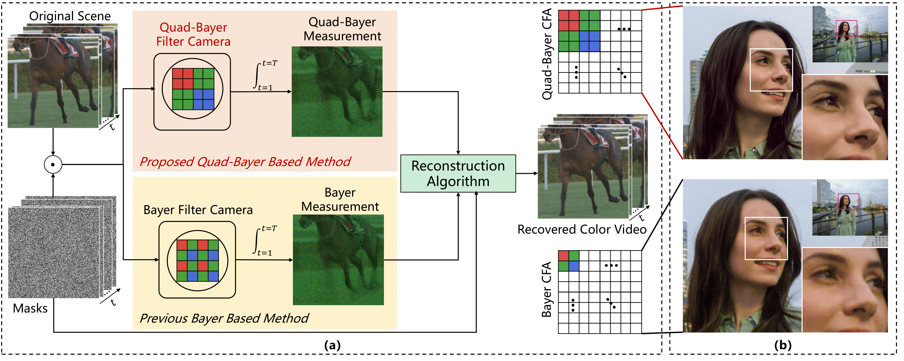
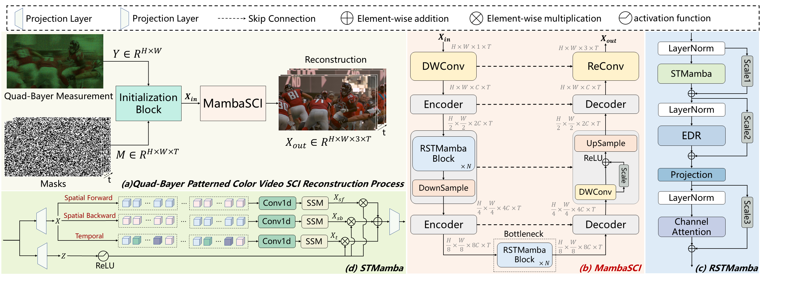
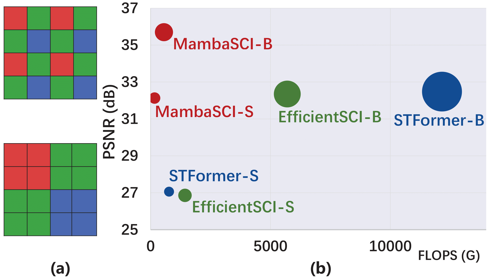

# 🐍 MambaSCI: Efficient Mamba-UNet for Quad-Bayer Patterned Video Snapshot Compressive Imaging
 

---

    

Try to [drag](https://imgsli.com/MzA1MjE3) by yourself to feel the "before/after slider albums" of obtaining the reconstructed first RGB video frame from the 2D compressed measurement.

---
**Abstract:** Color video snapshot compressive imaging (SCI) employs computational imaging techniques to capture multiple sequential video frames in a single Bayer-patterned measurement. With the increasing popularity of quad-Bayer pattern in mainstream smartphone cameras for capturing high-resolution videos, mobile photography has become more accessible to a wider audience. However, existing color video SCI reconstruction algorithms are designed based on the traditional Bayer pattern. When applied to videos captured by quad-Bayer cameras, these algorithms often result in color distortion and ineffective demosaicing, rendering them impractical for primary equipment. To address this challenge, we propose the MambaSCI method, which leverages the Mamba and UNet architectures for efficient reconstruction of quad-Bayer patterned color video SCI. To the best of our knowledge, our work presents the first algorithm for quad-Bayer patterned SCI reconstruction, and also the initial application of the Mamba model to this task. Specifically, we customize Residual-Mamba-Blocks, which residually connect the Spatial-Temporal Mamba (STMamba), Edge-Detail-Reconstruction (EDR) module, and Channel Attention (CA) module. Respectively, STMamba is used to model long-range spatial-temporal dependencies with linear complexity, EDR is for better edge-detail reconstruction, and CA is used to compensate for the missing channel information interaction in Mamba model. Experiments demonstrate that MambaSCI surpasses state-of-the-art methods with lower computational and memory costs. PyTorch style pseudo-code for the core modules is provided in the supplementary materials.

    

### • Framework

### • Model efficiency and effectiveness

## 📧 News
- **Sept. 26, 2024:** MambaSCI is submitted to NeurIPS 2024 🍁

## 🔗 Contents
- [ ] [Installation](#Installation)
- [ ] [Training](#training)
- [ ] [Testing](#testing)
- [ ] [Results](#Results)

